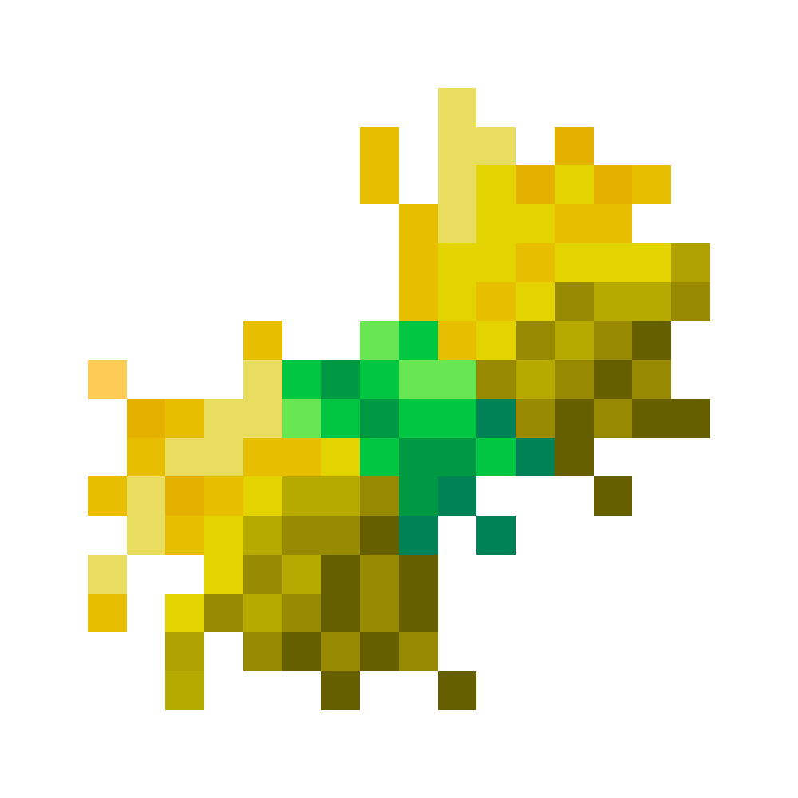

<h2 align="center">UAProject - Complex of Unique Minecraft Servers </h2>

###

  

---

<h2 align="center"> 🌟 Welcome to Our Minecraft Community </h2>

Dive into a world of endless possibilities and adventure with our Minecraft survival servers, powered by custom plugins and fueled by a vibrant community. From ukrainians for ukrainians, and not only! We welcome almost all nations and people from all over the world. Will be pleasure to meet you!

---

### 🌍 About Our Minecraft Community

  <ul>
    <li>🎮 <b>Unique Minecraft Survival Servers</b> - Explore and thrive in customized worlds built for adventure.</li> 
    <li>⚙️ <b>Custom Plugins</b> - Handcrafted by us, tailored for a truly unique experience.</li> 
    <li>🌐 <b>Modern Website</b> - Featuring a wiki powered by <a href="https://starlight.astro.build/" target="_blank">Starlight</a> for all your informational needs.</li> 
    <li>🤝 <b>Friendly Community</b> - Join a welcoming group of players with diverse interests and shared goals.</li> 
    <li>🎉 <b>Exciting Events</b> - Collaborations, partnerships, and community-driven celebrations await!</li> 
  </ul> 

---

### 🚀 Getting Started

1. **Join the Server**
    - Launch Minecraft (Java Edition).
    - Add our server IP: mc.uaproject.xyz
    - Dive in and start your journey!
2. **Explore the Wiki**
    - Visit our [Wiki](https://www.uaproject.xyz/wiki) to get started with tutorials, FAQs, and gameplay tips.
3. **Get Involved**
    - Participate in our events and connect with others in our [Discord Community](https://discord.gg/uaproject).

---

### 🛠️ Contributions

We love collaborating with the community! Whether you’re a developer, designer, or just a passionate player, here’s how you can contribute:
  - **Report Bugs**: Found a glitch? Let us know in the [Issues](https://discord.com/channels/1221552838807654450/1221886328040587304).
  - **Suggest Features**: Got an idea? Share it on our [Discussion Board](https://discord.com/channels/1221552838807654450/1221861941778055363).
  - **Submit Code**: Fork the repo and send us a pull request with your awesome improvements.

--- 

### 📬 Contact Us
  - Discord: [Join Our Community](https://discord.gg/uaproject)
  - Email: uaprojectcorp@gmail.com
  - Website: [Here we are as well!](https://www.uaproject.xyz/)

### ❤️ Support
Love what we’re building? You can support us in the following ways:
  - Spread the word! Share our project with friends and fellow players.
  - Contribute via GitHub or donate to keep the servers running smoothly.
--- 
